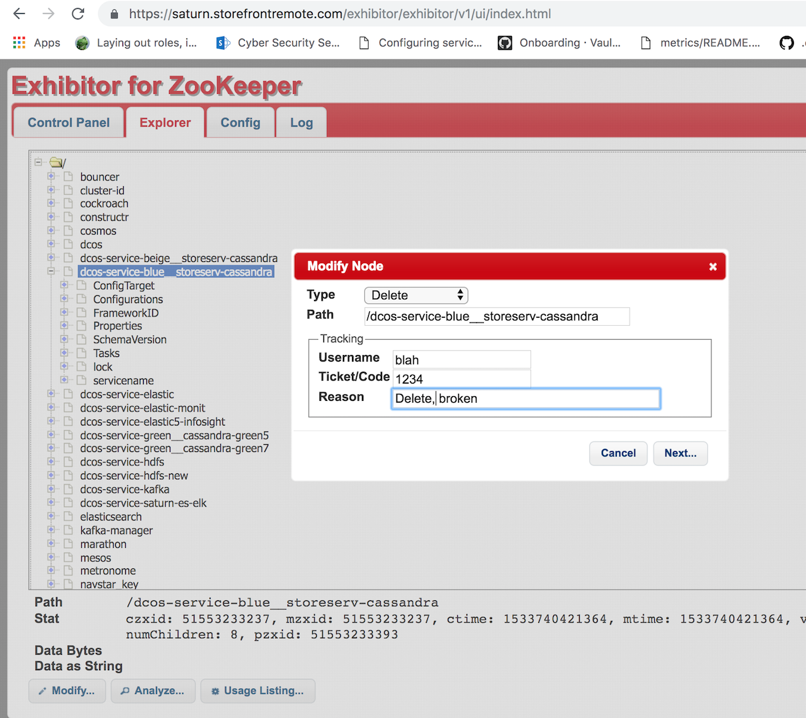

# How to force DCOS framework deletion
##### Below is an example for cassandra but these steps can also we use for HDFS, Elasticsearch, or other frame running on DCOS

1. Get the Cassandra framework ID running the command line dcos service or from mesos endpoint  
  - Example: https://saturn.storefrontremote.com/mesos/#/frameworks  

2. Send current master node teardown endpoint to delete framework from mesos
  - Example: `curl -X POST -d 'frameworkId=508bc08a-efd4-433e-a431-4dd0f0b997ca-0171' http://16.222.96.75:5050/master/teardown`

3. Remove the cassandra marathon app from DC/OS client
  - `dcos marathon app remove --force <app_id>`
  - Example: `dcos marathon app remove --force blue/storeserv-cassandra`

4. Remove framework zookeeper information exhibitor UI
  - https://saturn.storefrontremote.com/exhibitor
  - explorer -> "select directory for framework" -> Modify node -> delete  
  
